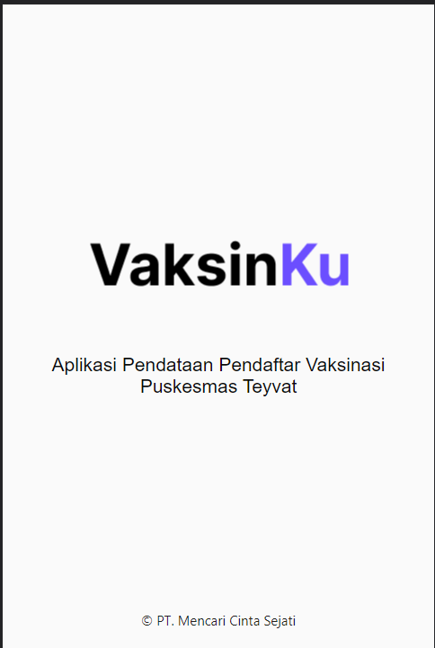
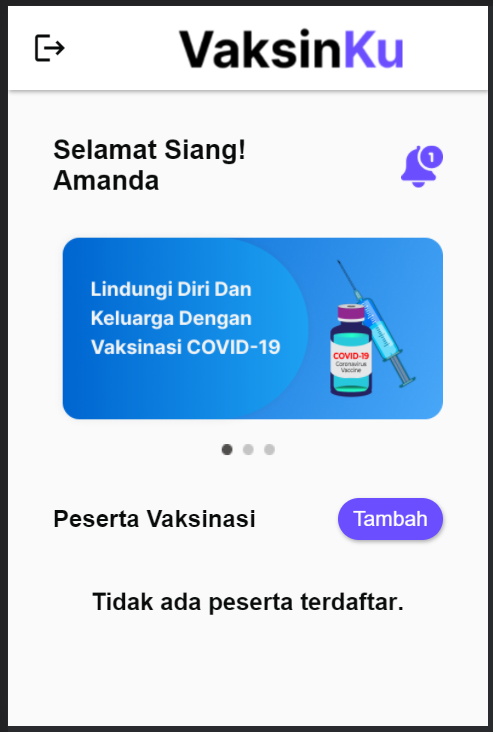
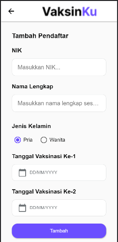
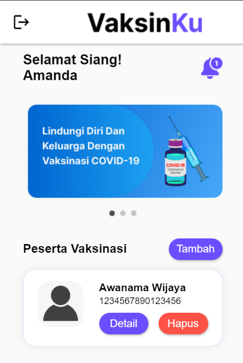
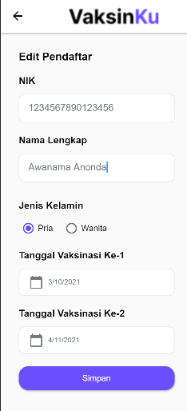
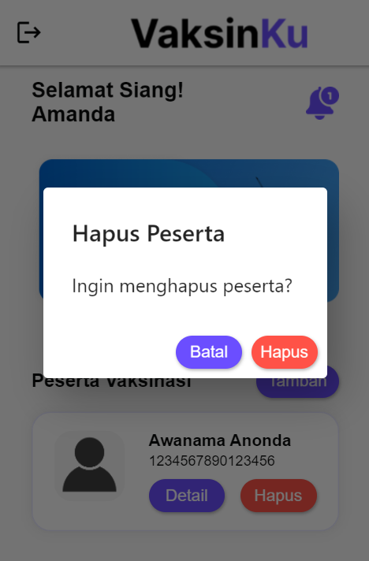

# Tugas 5: Vaksinku

## Kelompok
- Abdul Aziz Permana
- Jaka Asa Baldan Ahmad

## Deskripsi Singkat
Pada tugas 5, kami membuat sebuah aplikasi bernama VaksinKu yang berfungsi untuk mendata peserta vaksinasi di suatu puskesmas. Aplikasi ini memungkinkan pengguna untuk melakukan Create, Read, Update, dan Delete (CRUD) pada data peserta.

## Screenshot Laman

    

        <h3>Tampilan Bagian Splash Screen</h3>
         
        <a>Ditampilkan selama beberapa detik saat memulai aplikasi</a>
    

    

        <h3>Tampilan Bagian Dashboard</h3>
         
        <a>Tampilan awal dashboard tanpa ada data peserta</a>
    

    

        <h3>Tampilan Bagian Tambah Peserta</h3>
         
        <a>Formulir tambah peserta</a>
    

    

        <h3>Tampilan Bagian Dashboard Hasil Penambahan Peserta</h3>
         
        <a>Tampilan dashboard setelah peserta berhasil ditambahkan</a>
    

    

        <h3>Tampilan Bagian Detail/Edit Peserta</h3>
         
        <a>Formulir tambah peserta, dilakukan perubahan pada nama peserta</a>
    

    

        <h3>Tampilan Bagian Dialog Konfirmasi Penghapusan</h3>
         
        <a>Munculnya dialog konfirmasi ketika akan dilakukan penghapusan peserta</a>
    

    

